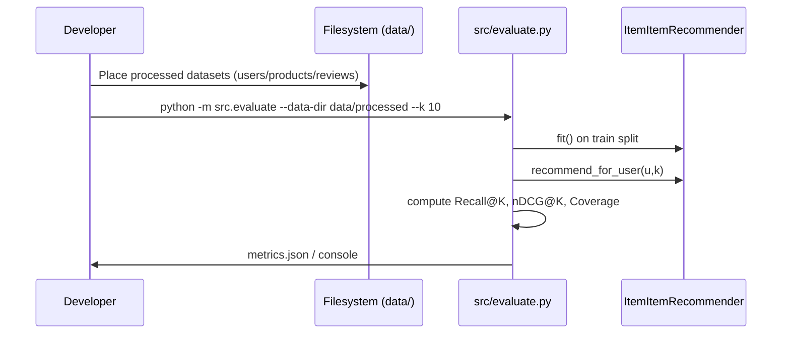
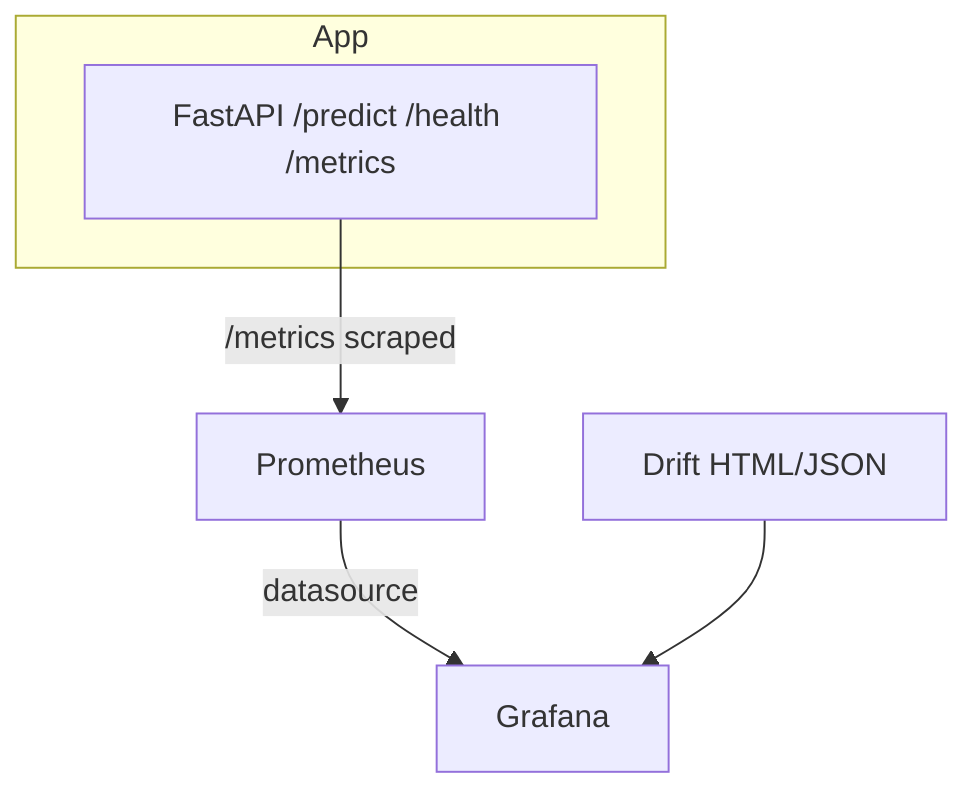

# product-review-analyzer
This is a product review analyzer multi modal project for course MLOps

An end-to-end MLOps pipeline that ingests Amazon-style product reviews, trains an item–item collaborative filtering recommender, and serves real-time recommendations via a FastAPI endpoint with production monitoring (Prometheus/Grafana) and data-drift reports (Evidently).

Milestone 1 verifies that each project team has translated its idea into a production-ready repository skeleton.

## Model Registry
Our trained models are tracked and versioned using MLflow. The latest production model (v1.0) is registered as `product-recommender` and can be accessed via the MLflow UI.

### MLflow Setup
1. Start the MLflow server:
```bash
mlflow server --host 0.0.0.0 --port 5000
```

2. Access the MLflow UI at: http://localhost:5000

3. View registered models at: http://localhost:5000/#/models

The latest model version (v1.0) is deployed and being used by our API for predictions.

We follow the Contributor Covenant Code of Conduct. Please read it before contributing.
## STEPS TO RUN THE PROJECT LOCALLY

### MILESTONE 1
first create a virtual environment
```bash
python -m venv mlops-venv
.mlops-venv\Scripts\activate
```
then install the requirements
```bash
pip install -r requirements.txt
```
then activate the pre-commit hooks
```bash
pre-commit install
```


When you want to run with prometheus and grafana
docker-compose up --build

Prometheus runs on this
http://localhost:9090

Grafana runs on this
http://localhost:3000

Grafana username: admin, pw: admin

working
http://13.60.193.55:8000/docs#/default/recommend_recommend_get
http://13.60.193.55:3000/login
http://13.60.193.55:9090/targets
http://13.60.193.55:8000/health


images/evidently_report_1.png
images/evidently_report_2.png
images/fast-api.jpg
images/grafana-dashboard-1.png
images/grafana-dashboard-2.png
images/grafana-dashboard-3.jpg
images/mlflow-1.png
images/mlflow-2.png
images/mlflow-3.png


# Product Review Recommender (Milestone-1 · MLOps)

End-to-end **Milestone-1** skeleton for an Amazon-style product reviews recommender system.
Focus: **Item–Item Collaborative Filtering**, offline **evaluation (Recall@K, nDCG@K, Catalog Coverage)**, **MLflow** tracking/registration, **FastAPI** service with **Prometheus** metrics, **Grafana** dashboard, and **Evidently** data-drift reporting.

> Milestone-1 goal: show a production-ready repository structure, runnable scripts, and baseline monitoring hooks.

---

## Contents

* [Architecture (Mermaid)](#architecture-mermaid)
* [Repository Structure](#repository-structure)
* [Data](#data)
* [Model](#model)
* [Evaluation](#evaluation)
* [API & Monitoring](#api--monitoring)
* [Grafana & Prometheus](#grafana--prometheus)
* [Evidently (Data Drift)](#evidently-data-drift)
* [MLflow (Model Registry)](#mlflow-model-registry)
* [Local Development](#local-development)
* [Docker / Compose](#docker--compose)
* [Makefile Targets](#makefile-targets)
* [Pre-commit, Quality & Security](#pre-commit-quality--security)
* [Known Issues / TODOs](#known-issues--todos)
* [License](#license)

---

## Architecture (Mermaid)

```mermaid
flowchart LR
  A[Raw Reviews CSVs] --> B[Data Cleaning / Splits]
  B --> C[Item–Item CF Model\n(cosine on item co-occurrence)]
  C --> D[Offline Evaluation\nRecall@K / nDCG@K / Coverage]
  C --> E[MLflow Tracking & Registry]
  C --> F[FastAPI Inference /metrics]
  F --> G[Prometheus Scrape]
  G --> H[Grafana Dashboard]
  B --> I[Evidently Drift Report]
  I --> H
```

### Data Flow (Mermaid)



### Monitoring Topology (Mermaid)



---

## Repository Structure

```
.
├─ data/
│  ├─ raw/               # (placeholder)
│  ├─ processed/         # users.csv, products.csv, reviews.csv, product_categories.csv
│  └─ splits/
│     ├─ train/          # train_set.csv, val_set.csv
│     └─ test/           # (leave-one-out generated or derived)
├─ src/
│  ├─ api.py             # FastAPI app with Prometheus instrumentation (/metrics)
│  ├─ train.py           # Train + register model with MLflow
│  ├─ evaluate.py        # Offline evaluation (Recall@K, nDCG@K, Coverage)
│  └─ ml/
│     ├─ recommenders/
│     │  └─ item_item.py           # Item–Item CF recommender
│     └─ eval/
│        ├─ eval_dataset.py        # Leave-One-Out split builder
│        └─ metrics.py             # recall@k, ndcg@k, catalog coverage
├─ monitoring/
│  ├─ generate_drift.py  # Generates Evidently drift report
│  ├─ evidently_app.py   # Serves drift report via FastAPI (port 7000)
│  └─ evidently_report.html
├─ infra/
│  ├─ prometheus/prometheus.yml
│  └─ grafana-dashboards/dashboard-1.json
├─ images/               # screenshot assets
├─ docker-compose.yml
├─ Dockerfile
├─ Makefile
├─ requirements.txt      # UTF-16 encoded
├─ .pre-commit-config.yaml
├─ .secrets.baseline
├─ LICENSE
└─ README.md
```

---

## Data

Expected **processed** CSVs (already present under `data/processed/`):

* `users.csv` — user ids
* `products.csv` — product ids/meta
* `reviews.csv` — user–product interactions (implicit feedback derived from ratings/reviews)
* `product_categories.csv` — optional content features (not used in Item–Item baseline)

Training/validation/test are placed under `data/splits/train/` and `data/splits/test/`.
A helper in `src/ml/eval/eval_dataset.py` builds **Leave-One-Out** splits where each eligible user’s single held-out interaction becomes the test target.

---

## Model

**Item–Item Collaborative Filtering** (cosine similarity on co-occurrence):

* Build a sparse **user × item** matrix.
* Compute **item–item** cosine similarity.
* For a user, retrieve top-K similar items to items they have interacted with, filter seen items, and aggregate scores.

Entry point: `src/ml/recommenders/item_item.py` (class `ItemItemRecommender`).

---

## Evaluation

Script: `src/evaluate.py`

* **Metrics** (see `src/ml/eval/metrics.py`):

  * `Recall@K`: `1.0` if true item appears in top-K, else `0.0`
  * `nDCG@K`: `1 / log2(rank+1)` when true item is in the list
  * **Catalog Coverage**: fraction of unique recommended items vs total catalog

Run:

```bash
# Example
python -m src.evaluate --data-dir data/processed --k 10
```

Outputs summary metrics to console; you can easily extend to write JSON/CSV.

---

## API & Monitoring

Script: `src/api.py` (FastAPI)

* `GET /health` → `{"status": "ok"}`
* `POST /predict` → stubbed example `{"label": "positive", "score": 0.93}`
* `GET /metrics` → Prometheus text format (provided by `prometheus_fastapi_instrumentator`), plus custom counters/histograms:

  * `predictions_total`
  * `prediction_latency_seconds`

Local dev:

```bash
# Hot-reload dev server
make dev
# -> uvicorn src.api:app --host 0.0.0.0 --port 8000
# Metrics at: http://localhost:8000/metrics
```

---

## Grafana & Prometheus

### Compose topology

`docker-compose.yml` includes services for **prometheus**, **grafana**, and **recommender** (FastAPI).
Prometheus scrapes `recommender:8000/metrics` (see `infra/prometheus/prometheus.yml`).

> In the file, some blocks are commented for clarity. Uncomment the sections you need.

### Quick start

```bash
# Bring up the monitoring stack (Prometheus + Grafana + API container)
make stack-up
# or
docker compose up -d
```

* Prometheus: [http://localhost:9090](http://localhost:9090)
* Grafana: [http://localhost:3000](http://localhost:3000)  (default admin/admin)

### Persisting Grafana dashboards

So you don’t have to rebuild dashboards every time:

1. Keep JSON under `infra/grafana-dashboards/*.json` (already provided).
2. Add Grafana volumes for **provisioning** and **data**:

```yaml
# docker-compose.yml (grafana service)
volumes:
  - ./infra/grafana-dashboards:/var/lib/grafana/dashboards:ro
  - ./infra/grafana-provisioning:/etc/grafana/provisioning:ro
  - grafana_data:/var/lib/grafana
```

3. Add a provisioning file `infra/grafana-provisioning/dashboards.yml`:

```yaml
apiVersion: 1
providers:
  - name: 'Default'
    orgId: 1
    type: file
    disableDeletion: false
    options:
      path: /var/lib/grafana/dashboards
```

4. Provision Prometheus datasource `infra/grafana-provisioning/datasources.yml`:

```yaml
apiVersion: 1
datasources:
  - name: Prometheus
    type: prometheus
    access: proxy
    url: http://prometheus:9090
    isDefault: true
```

> With this, your dashboards (e.g., `infra/grafana-dashboards/dashboard-1.json`) are auto-loaded and **persisted** across container restarts.

---

## Evidently (Data Drift)

* Generate drift report:

```bash
make drift
# -> monitoring/evidently_report.html
```

* Serve a tiny drift dashboard (FastAPI on port 7000):

```bash
make serve-drift
# -> http://localhost:7000
```

`monitoring/evidently_app.py` mounts the `monitoring/` directory as static so the HTML opens from the same service.

---

## MLflow (Model Registry)

Local MLflow (UI at `http://localhost:5000`):

```bash
# Terminal 1: start the server
mlflow server --host 0.0.0.0 --port 5000

# Terminal 2: train & register a model run
python src/train.py
```

* `src/train.py` is wired to call `mlflow.set_tracking_uri("http://localhost:5000")`
* The model is logged and (optionally) registered as `product-recommender`

> (Optional) You can point MLflow to S3 by changing the tracking URI to your bucket if you’ve configured `awscli` (see `requirements`).

---

## Local Development

### Prereqs

* Python 3.11+
* (Optional) Docker Desktop
* (Optional) `awscli` (if using S3 for MLflow)

### Setup

> Note: `requirements.txt` is **UTF-16** encoded. Most tools handle it, but if needed, open with UTF-16.

```bash
python -m venv .venv
source .venv/bin/activate        # Windows: .venv\Scripts\activate
pip install -r requirements.txt  # handles UTF-16 fine
pre-commit install
```

---

## Docker / Compose

The included `Dockerfile` builds a slim runtime for the app.
To run the full stack with monitoring:

```bash
docker compose up --build
# Prometheus: http://localhost:9090
# Grafana:    http://localhost:3000
# API:        http://localhost:8000
```

> If you only want the API locally with hot-reload: `make dev`

---

## Makefile Targets

```make
dev          # uvicorn src.api:app --reload (port 8000)
train        # python src/train.py
drift        # python monitoring/generate_drift.py
serve-drift  # uvicorn monitoring.evidently_app:app --port 7000
stack-up     # docker compose up -d
stack-down   # docker compose down
```

---

## Pre-commit, Quality & Security

* `.pre-commit-config.yaml` — formatting (Black), lint (Ruff), basic secret detection (`detect-secrets`), common hooks.
* `.secrets.baseline` — baseline for secret scanner to reduce noise.
* `src/tests/test_health.py` — basic health test (pytest compatible).

Run hooks manually:

```bash
pre-commit run --all-files
```

Run tests:

```bash
pytest -q
```

---

## Known Issues / TODOs

> These are minor path mismatches I found while reading the repo. Listing them here so you can fix in one pass (or leave as “Milestone-2 cleanups”).

1. **Dockerfile entrypoint paths**

   * Current `Dockerfile` copies `src/app` and runs `src.app.main:app`, but the FastAPI app lives in `src/api.py`.
   * **Fix**: either move the API to `src/app/main.py` or adjust the `Dockerfile` to:

     ```dockerfile
     COPY src ./src
     CMD ["uvicorn", "src.api:app", "--host", "0.0.0.0", "--port", "8000"]
     ```

2. **Training import path**

   * `src/train.py` uses `from ml.recommenders ...` but the rest of the project uses `from src.ml ...`
   * **Fix**: change to:

     ```python
     from src.ml.recommenders.item_item import ItemItemRecommender
     ```

3. **Evaluate script partial lines**

   * Some lines in `src/evaluate.py` look truncated in the copy I saw (e.g., variable name cut mid-word). Just ensure the final for-loop collects per-user metrics and prints/records aggregates.

4. **Tests import path**

   * `src/tests/test_health.py` imports `from app.main import app`.
   * **Fix**: change to `from src.api import app`.

5. **Compose comments**

   * `docker-compose.yml` has multiple commented blocks. Keep only one canonical set for Prometheus/Grafana/Api to avoid confusion.

---

## License

This project is released under the **MIT License**. See `LICENSE`.

---

### Credits

* Recommender baseline: Item–Item (cosine)
* Monitoring: Prometheus + Grafana + Evidently
* Tracking: MLflow
* API: FastAPI (with `prometheus_fastapi_instrumentator`)
