# 🛍️ **Product Review Analyzer & Recommender System**


<p align="left">
  
</p>

### *An AI-Powered MLOps Project for Scalable Product Intelligence*

> ⚙️ **Milestone-1:** *From Notebook → Reproducible Repository*
> 🎯 **Next (Milestone-2):** *LLMOps Integration — Personalized Review Generation with Large Language Models*

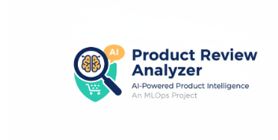

---

## 🚀 **Elevator Pitch**

Welcome to **Product Review Analyzer**, an **end-to-end MLOps project** that turns **raw Amazon-style reviews** into actionable intelligence 🔍.
Our system builds an **Item–Item Collaborative Filtering recommender**, tracks it through **MLflow**, monitors it via **Prometheus + Grafana**, and checks for **data drift using Evidently** — all served through a **FastAPI microservice**.

💡 In **Milestone-2 (LLMOps Phase)**, we’ll integrate **LLMs** to:

* 🧠 Generate **personalized product summaries**.
* 💬 Recommend **context-aware reviews**.
* 🛒 Help users **make informed shopping decisions** faster and smarter.

---

## 🧩 **Key Features**

| Area                        | Feature                           | Tool/Framework                          |
| --------------------------- | --------------------------------- | --------------------------------------- |
| 💾 **Data Handling**        | Raw → Processed → Split           | Pandas, Scikit-learn                    |
| 🧠 **Modeling**             | Item–Item Collaborative Filtering | Custom Python module                    |
| 📈 **Experiment Tracking**  | Run tracking & model registry     | **MLflow**                              |
| 🌐 **Serving**              | REST API with Prometheus metrics  | **FastAPI + Prometheus Instrumentator** |
| 📊 **Monitoring**           | Dashboards and alerting           | **Grafana + Prometheus**                |
| ⚙️ **Data Drift Detection** | Report generation                 | **Evidently AI**                        |
| 🐳 **Containerization**     | Multi-service stack               | **Docker Compose**                      |
| 🧪 **CI/CD & QA**           | Automated linting & testing       | **GitHub Actions**, Pre-commit          |
| ☁️ **Cloud Integration**    | Hosted on AWS EC2                 | **AWS Cloud Infrastructure**            |

---

## 🧱 **Architecture Overview**

### 🧭 End-to-End Pipeline

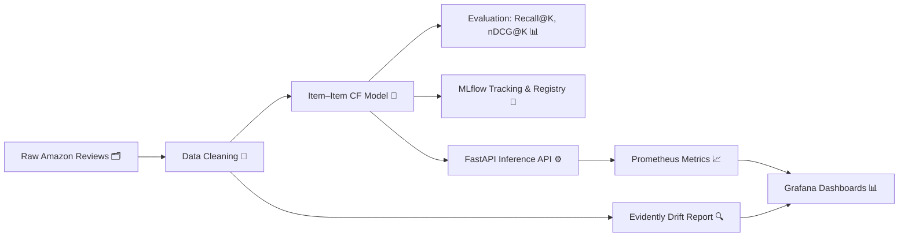
## 🧠 System Architecture


[View full MLOps Pipeline diagram](images/mlops_pipeline.svg)
---

## 📂 **Repository Structure**

```
.
├── src/
│   ├── api.py                  # FastAPI App
│   ├── train.py                # Model Training + MLflow Registration
│   ├── evaluate.py             # Evaluation Metrics
│   └── ml/
│       ├── recommenders/
│       │   └── item_item.py    # Item–Item Collaborative Filtering
│       └── eval/
│           ├── metrics.py      # recall@K, nDCG@K, coverage
│           └── eval_dataset.py # leave-one-out split generator
├── monitoring/
│   ├── generate_drift.py
│   ├── evidently_app.py
│   └── evidently_report.html
├── infra/
│   ├── prometheus/prometheus.yml
│   ├── grafana-dashboards/
│   └── grafana-provisioning/
├── data/
│   ├── raw/
│   ├── processed/
│   └── splits/
├── docker-compose.yml
├── Dockerfile
├── Makefile
├── requirements.txt
├── CONTRIBUTION.md
├── LICENSE
├── .pre-commit-config.yaml
└── README.md
```

---

## 📦 **Quick Start**

### 🧰 1. Clone & Setup

```bash
git clone https://github.com/YourOrg/product-review-analyzer.git
cd product-review-analyzer

# create environment
python -m venv .venv
source .venv/bin/activate     # (Windows: .venv\Scripts\activate)

# install dependencies
pip install -r requirements.txt

# activate pre-commit hooks
pre-commit install
```

### 🧠 2. Train and Track Model

```bash
mlflow server --host 0.0.0.0 --port 5000
python src/train.py
```

Access MLflow UI → [http://localhost:5000](http://localhost:5000)
Latest model: **`product-recommender:v1.0`**

---

### ⚡ 3. Run the API Locally

```bash
make dev
# OR manually:
uvicorn src.api:app --host 0.0.0.0 --port 8000
```

Endpoints:

* `/docs` → interactive FastAPI Swagger UI
* `/health` → health check
* `/metrics` → Prometheus metrics

Example:

```bash
curl -X POST "http://localhost:8000/predict" -H "Content-Type: application/json" -d '{"user_id": 123, "k": 10}'
```
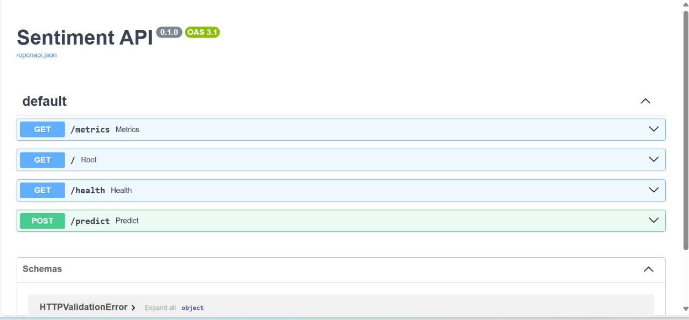
---

### 🧠 4. Run Monitoring Stack

```bash
docker compose up --build
```

| Service         | URL                                                      | Default Login |
| --------------- | -------------------------------------------------------- | ------------- |
| API             | [http://localhost:8000/docs](http://localhost:8000/docs) | —             |
| Prometheus      | [http://localhost:9090](http://localhost:9090)           | —             |
| Grafana         | [http://localhost:3000](http://localhost:3000)           | admin / admin |
| Evidently Drift | [http://localhost:7000](http://localhost:7000)           | —             |

---

## 📈 **Evaluation**

We measure:

* ✅ **Recall@K** → true item in top-K?
* ✅ **nDCG@K** → discounted gain for correct ranking
* ✅ **Catalog Coverage** → % of unique items recommended

Run manually:

```bash
python -m src.evaluate --data-dir data/processed --k 10
```

---

## 🧾 **MLflow Model Registry**

Tracked & versioned experiments with MLflow.

| Model                 | Version | Stage      | URI                                                              |
| --------------------- | ------- | ---------- | ---------------------------------------------------------------- |
| `product-recommender` | v1.0    | Production | [http://localhost:5000/#/models](http://localhost:5000/#/models) |

To start MLflow tracking server:

```bash
mlflow server --host 0.0.0.0 --port 5000
```

---

## 📊 **Monitoring with Prometheus + Grafana**

* Prometheus scrapes `/metrics` from FastAPI.
* Grafana visualizes:

  * API latency
  * Requests per second
  * Prediction counts

📸 **Dashboard Snapshots:**
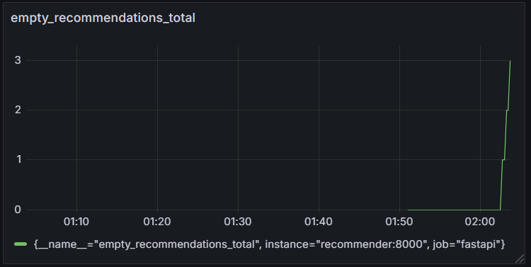
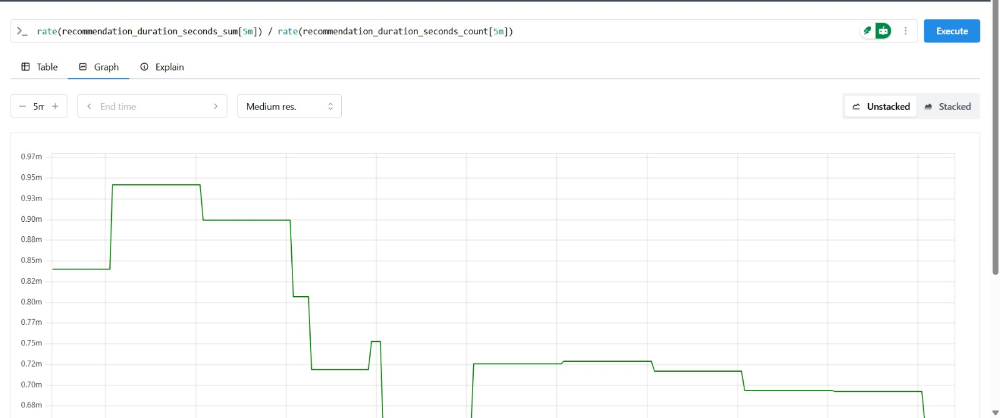

---

## 🧮 **Evidently (Data Drift Reports)**

Generate drift report:

```bash
make drift
```

Serve the dashboard:

```bash
make serve-drift
```

👉 [http://localhost:7000](http://localhost:7000)

📸 Example:
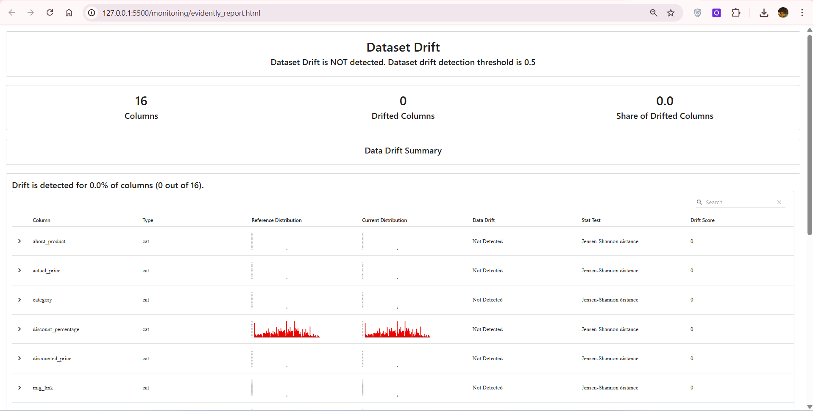

---

## ☁️ **Cloud Deployment**

### 🌩️ AWS Integration

| Component     | AWS Service Used          | Purpose                  |
| ------------- | ------------------------- | ------------------------ |
| API Hosting   | **EC2**                   | Host FastAPI container   |
| Model Storage | **S3**                    | MLflow backend artifacts |
| Monitoring    | **CloudWatch (optional)** | Alerting / Logs          |

### 🖼️ AWS Components

<p align="center">
  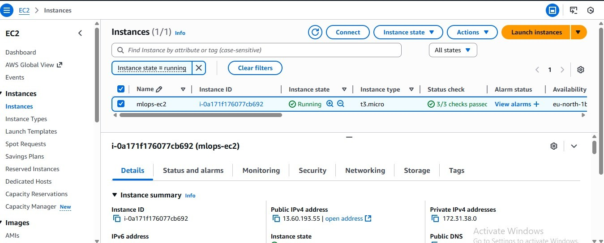
  &nbsp;&nbsp;&nbsp;
  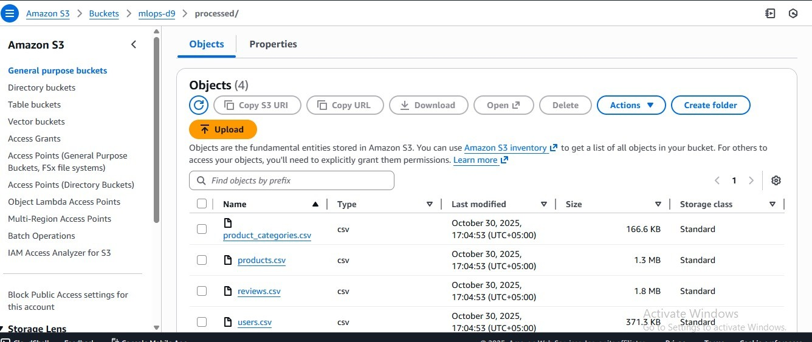
</p>

See 👉 [images](images) for additional setup and configuration screenshots !


🔧 **How to Reproduce Cloud Setup:**

1. Launch EC2 instance (Ubuntu 22.04, t2.medium)
2. Install Docker + Docker Compose
3. Clone repo and run `docker compose up -d`
4. Access the live stack:

| Service    | Public URL                                                     |
| ---------- | -------------------------------------------------------------- |
| API Docs   | [http://13.60.193.55:8000/docs](http://13.60.193.55:8000/docs) |
| Grafana    | [http://13.60.193.55:3000](http://13.60.193.55:3000)           |
| Prometheus | [http://13.60.193.55:9090](http://13.60.193.55:9090)           |

---

## ⚙️ **Makefile Targets**

| Command            | Description                       |
| ------------------ | --------------------------------- |
| `make dev`         | Run FastAPI with hot-reload       |
| `make train`       | Train and register model          |
| `make drift`       | Generate Evidently drift report   |
| `make serve-drift` | Serve drift dashboard (port 7000) |
| `make stack-up`    | Bring up Docker monitoring stack  |
| `make stack-down`  | Stop Docker containers            |

---


Includes:

* Member names & ERP IDs
* Task allocation (data, model, infra, monitoring)
* Branch naming conventions (`feat/`, `fix/`, `infra/`)

---

## 🧹 **Pre-Commit Hooks**

✅ Configured hooks:

* `trailing-whitespace`
* `end-of-file-fixer`
* `detect-secrets`
* `black` + `ruff` formatters

Run manually:

```bash
pre-commit run --all-files
```

---

## 🧪 **GitHub CI/CD (Milestone Requirement)**

| Stage            | Description                            |
| ---------------- | -------------------------------------- |
| 🧼 Lint          | Check style via Ruff + Black           |
| 🧠 Test          | Run pytest (≥80% coverage)             |
| 🏗️ Build        | Docker image tagged with `$GITHUB_SHA` |
| 🧪 Canary Deploy | Push image to canary env               |
| 🩺 Acceptance    | Test 5+ golden requests on canary      |

✅ Defined in `.github/workflows/ci.yml`

---

## 🧰 **FAQ**

**Q:** Why UTF-16 in requirements.txt?
**A:** Some systems needed BOM-encoded format for compatibility; open with UTF-16 in editors if installation fails.

**Q:** How do I fix Docker permission issues on Windows?
**A:** Run PowerShell as Admin → `wsl --update` → restart Docker Desktop.

**Q:** Grafana dashboard not showing data?
**A:** Ensure Prometheus target (`/metrics`) is healthy at [http://localhost:9090/targets](http://localhost:9090/targets).

---

## 🔮 **Future Vision (LLMOps Stage 2)**

> “Beyond recommendations — we aim for intelligent conversations about products.” 🧠💬

In Milestone-2, we’ll enhance our system into a **multimodal LLMOps pipeline**:

* 🤖 Generate **personalized product reviews** based on user history.
* 🗣️ Use **LLMs (like GPT-4 or Falcon)** for summarizing customer sentiment.
* 🔍 Provide **context-aware recommendations** combining embeddings from text and structured data.
* 📦 Deploy via **LangChain + FastAPI + MLflow Serving** with real-time drift alerts.

**Use Cases:**

* 🛍️ Smart shopping assistants that summarize reviews.
* 💬 Automated brand insight generation.
* 📈 Continuous model retraining triggered by drift reports.

---

## 🪪 **License & Compliance**

* 📜 **License:** MIT License — see `LICENSE`
* 🤝 **Code of Conduct:** Contributor Covenant — `CODE_OF_CONDUCT.md`
* 🧩 **Dependency Scan:** `pip-audit` integrated (fails build on critical CVEs)

---

## 🏁 **Known Issues / TODOs**

* [ ] Fix Dockerfile app entry path → `src.api:app`
* [ ] Validate all import paths in `train.py`
* [ ] Add additional unit tests for drift metrics
* [ ] Integrate GitHub container registry publishing

---

## ✨ **Screenshots**

| Component       | Preview                                      |
| --------------- | -------------------------------------------- |
| 🐳 Docker Setup | 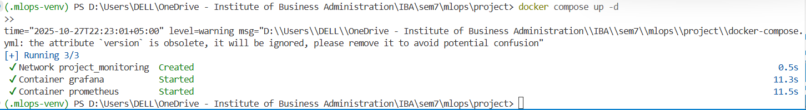     |
| 📈 Grafana      | 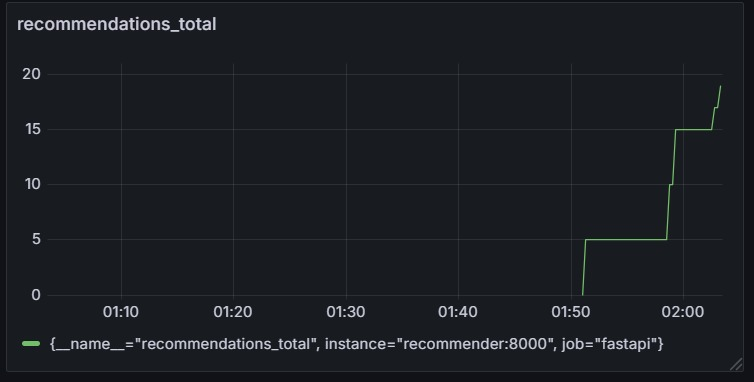 |
| 🧮 MLflow       | 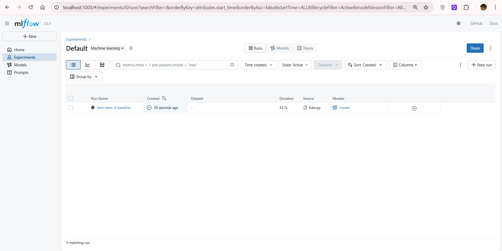               |
| 🔍 Evidently    | 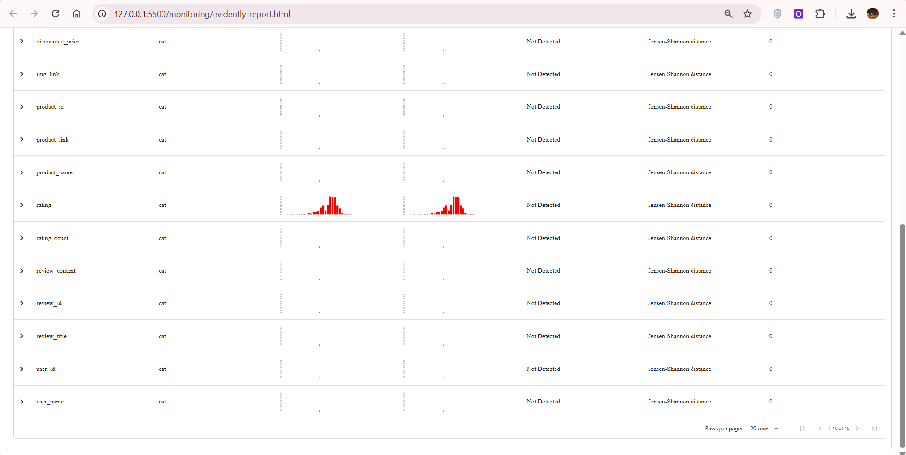      |

---

## 🌟 **Team**

| Name             | ERP ID | Role                                    |
| ---------------- | ------ | --------------------------------------- |
| **Zuha Aqib**    | 26106  | Team Lead — Data Pipeline & Model Training + CI/CD |
| **Maham Junaid** | 26909  | Cloud Integration & Monitoring setup    |
| **Maryam Ihsan** | 27152  | Evaluation & API Documentation    |
| **Muhammad Haaris** | 27083  | Data Pipeline & Model Training + CI/CD  |

---


## 🧩 Task Breakdown and Contributions

| Member           | Primary Responsibilities                       | Details of Work Done                                                                                                                                                                                                                                                                                                                                                                                                                                                                                |
| ---------------- | ---------------------------------------------- | --------------------------------------------------------------------------------------------------------------------------------------------------------------------------------------------------------------------------------------------------------------------------------------------------------------------------------------------------------------------------------------------------------------------------------------------------------------------------------------------------- |
| **Zuha Aqib**    | Data Pipeline, Model Training, and CI/CD | <ul><li>Led data cleaning and preprocessing of Amazon reviews dataset</li><li>Implemented core data pipeline architecture</li><li>Co-developed **Item–Item Collaborative Filtering** algorithm</li><li>Implemented GitHub Actions workflow for CI/CD pipeline</li><li>Set up automated testing and linting checks</li><li>Created data validation and model testing workflows</li><li>Managed model versioning and artifact tracking</li><li>Implemented automated deployment pipelines</li></ul> |
| **Muhammad Haaris** | Data Pipeline, Model Training, and CI/CD | <ul><li>Co-developed data preprocessing and cleaning workflows</li><li>Implemented train-test split methodology</li><li>Enhanced **Item–Item Collaborative Filtering** implementation</li><li>Set up Docker containerization for model training</li><li>Configured CI/CD pipelines for model deployment</li><li>Implemented automated model retraining workflows</li><li>Created data validation checks</li><li>Set up monitoring for model training pipelines</li></ul> |
| **Maham Junaid** | Cloud Integration & API Documentation | <ul><li>Implemented AWS EC2 instance setup for model deployment</li><li>Configured S3 buckets for data and model storage</li><li>Set up CloudWatch monitoring for model performance</li><li>Created comprehensive FastAPI documentation</li><li>Developed API schema and example cURL commands</li><li>Implemented automated API testing</li><li>Created cloud infrastructure documentation</li><li>Set up cloud-based monitoring dashboards</li></ul> |
| **Maryam Ihsan** | Cloud Integration & API Documentation | <ul><li>Configured AWS Lambda functions for serverless operations</li><li>Implemented automated cloud deployment scripts</li><li>Created cloud service integration documentation</li><li>Enhanced FastAPI documentation with detailed examples</li><li>Developed comprehensive API testing suite</li><li>Created cloud deployment guides in README.md</li><li>Documented cloud service interactions</li><li>Implemented cloud resource monitoring</li></ul> |

---

## 🌿 Branch-Naming Convention

| Branch Name                        | Prefix Category           | Purpose / Description                                                                                              |
| ---------------------------------- | ------------------------- | ------------------------------------------------------------------------------------------------------------------ |
| **`fix/structure`**                | `fix/`                    | Minor structural fixes and directory cleanup after initial setup (refined imports, paths, and relative structure). |
| **`infra/app-setup`**              | `infra/`                  | Configured application infrastructure — FastAPI service wiring, environment variables, and app-level organization. |
| **`infra/bootstrap-setup`**        | `infra/`                  | Initial repository bootstrap: virtual environment, Makefile, requirements, and local project scaffolding.          |
| **`infra/cloud-integration`**      | `infra/`                  | Cloud integration setup — connecting Dockerized services with cloud endpoints (planned deployment stage).          |
| **`ml-workflow-monitoring-setup`** | `ml-workflow/` *(custom)* | Integrated ML workflow monitoring — Prometheus, Grafana dashboards, and MLflow logging integration.                |
| **`main`**                         | —                         | Stable release branch for milestone submissions and final presentation.                                            |


## 🧑‍💻 **Contribution Guide**

See 👉 [CONTRIBUTION.md](CONTRIBUTION.md)
updated information can be found in CONTRIBUTION.md

## 🌟 **Bonus Features**

| Bonus Feature                                | Description                                                                                                         | Status        |
| -------------------------------------------- | ------------------------------------------------------------------------------------------------------------------- | ------------- |
| 🐳 *Docker Compose Multi-Service Setup*    | Separate containers/services for *App, **DB, **Prometheus, and **Grafana*. Supports dev/test/prod profiles. | ✅ Implemented |
| ⚡ *GPU-enabled Image & Self-Hosted Runner* | CI/CD pipeline uses GPU-enabled Docker image for model training and integrates with self-hosted GitHub runner.      | ▓▓░░░ 40%     |
| 🏗️ *IaC Sample (Terraform / MinIO)*       | Example scripts to spin up local object storage (MinIO) and other resources via Terraform or other IaC tools.       | ▓░░░░ 20%     |
| 📊 *End-to-End Load Test Script (k6)*      | Load testing scripts with latency SLO assertions for the deployed services.                                         | ▓░░░░ 30%     |
| 🛡️ *Dependency Vulnerability Scan*        | pip-audit checks for critical CVEs and fails build if found.                                                      | ✅ Implemented |
| 📦 *Git LFS (Large File Support)*          | Optional: Not required for this project due to dataset size, but pipeline supports it.                              | ✅ Implemented/ Optional   |

all remaining will be fully implemented in stage 2 !!!

## 💡 **Tag & Submission**

✅ Push with tag:

```bash
git tag v1.0-milestone1
git push origin v1.0-milestone1
```


---

### 💬 *“From product reviews to product intelligence — the journey starts here.”* 🧠💬✨

Developed with ❤️ by Team **Product Review Analyzer**

---
