# 🛍️ **Product Review Analyzer & Recommender System**


<p align="left">
  
</p>

### *An AI-Powered MLOps Project for Scalable Product Intelligence*

> ⚙️ **Milestone-1:** *From Notebook → Reproducible Repository*
> 🎯 **Next (Milestone-2):** *LLMOps Integration — Personalized Review Generation with Large Language Models*

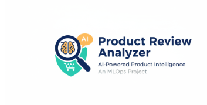

---

## 🚀 **Elevator Pitch**

Welcome to **Product Review Analyzer**, an **end-to-end MLOps project** that turns **raw Amazon-style reviews** into actionable intelligence 🔍.
Our system builds an **Item–Item Collaborative Filtering recommender**, tracks it through **MLflow**, monitors it via **Prometheus + Grafana**, and checks for **data drift using Evidently** — all served through a **FastAPI microservice**.

💡 In **Milestone-2 (LLMOps Phase)**, we’ll integrate **LLMs** to:

* 🧠 Generate **personalized product summaries**.
* 💬 Recommend **context-aware reviews**.
* 🛒 Help users **make informed shopping decisions** faster and smarter.

---

## 🧩 **Key Features**

| Area                        | Feature                           | Tool/Framework                          |
| --------------------------- | --------------------------------- | --------------------------------------- |
| 💾 **Data Handling**        | Raw → Processed → Split           | Pandas, Scikit-learn                    |
| 🧠 **Modeling**             | Item–Item Collaborative Filtering | Custom Python module                    |
| 📈 **Experiment Tracking**  | Run tracking & model registry     | **MLflow**                              |
| 🌐 **Serving**              | REST API with Prometheus metrics  | **FastAPI + Prometheus Instrumentator** |
| 📊 **Monitoring**           | Dashboards and alerting           | **Grafana + Prometheus**                |
| ⚙️ **Data Drift Detection** | Report generation                 | **Evidently AI**                        |
| 🐳 **Containerization**     | Multi-service stack               | **Docker Compose**                      |
| 🧪 **CI/CD & QA**           | Automated linting & testing       | **GitHub Actions**, Pre-commit          |
| ☁️ **Cloud Integration**    | Hosted on AWS EC2                 | **AWS Cloud Infrastructure**            |

---

## 🧱 **Architecture Overview**

### 🧭 End-to-End Pipeline

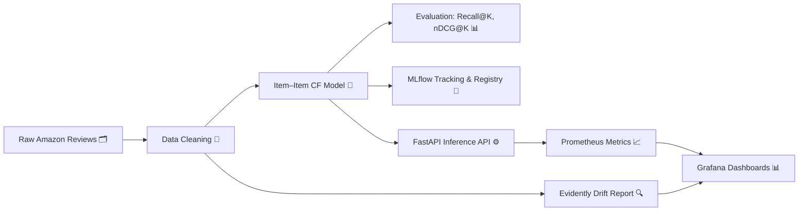
```mermaid
flowchart LR
  A[Raw Amazon Reviews 🗂️] --> B[Data Cleaning 🧹]
  B --> C[Item–Item CF Model 🧠]
  C --> D[Evaluation: Recall@K, nDCG@K 📊]
  C --> E[MLflow Tracking & Registry 🧾]
  C --> F[FastAPI Inference API ⚙️]
  F --> G[Prometheus Metrics 📈]
  G --> H[Grafana Dashboards 📊]
  B --> I[Evidently Drift Report 🔍]
  I --> H
```
## 🧠 System Architecture


[View full MLOps Pipeline diagram](images/mlops_pipeline.svg)
---

## 📂 **Repository Structure**

```
.
├── src/
│   ├── api.py                  # FastAPI App
│   ├── train.py                # Model Training + MLflow Registration
│   ├── evaluate.py             # Evaluation Metrics
│   └── ml/
│       ├── recommenders/
│       │   └── item_item.py    # Item–Item Collaborative Filtering
│       └── eval/
│           ├── metrics.py      # recall@K, nDCG@K, coverage
│           └── eval_dataset.py # leave-one-out split generator
├── monitoring/
│   ├── generate_drift.py
│   ├── evidently_app.py
│   └── evidently_report.html
├── infra/
│   ├── prometheus/prometheus.yml
│   ├── grafana-dashboards/
│   └── grafana-provisioning/
├── data/
│   ├── raw/
│   ├── processed/
│   └── splits/
├── docker-compose.yml
├── Dockerfile
├── Makefile
├── requirements.txt
├── CONTRIBUTION.md
├── LICENSE
├── .pre-commit-config.yaml
└── README.md
```

---

## 📦 **Quick Start**

### 🧰 1. Clone & Setup

```bash
git clone https://github.com/YourOrg/product-review-analyzer.git
cd product-review-analyzer

# create environment
python -m venv .venv
source .venv/bin/activate     # (Windows: .venv\Scripts\activate)

# install dependencies
pip install -r requirements.txt

# activate pre-commit hooks
pre-commit install
```

### 🧠 2. Train and Track Model

```bash
mlflow server --host 0.0.0.0 --port 5000
python src/train.py
```

Access MLflow UI → [http://localhost:5000](http://localhost:5000)
Latest model: **`product-recommender:v1.0`**

---

### ⚡ 3. Run the API Locally

```bash
make dev
# OR manually:
uvicorn src.api:app --host 0.0.0.0 --port 8000
```

Endpoints:

* `/docs` → interactive FastAPI Swagger UI
* `/health` → health check
* `/metrics` → Prometheus metrics

Example:

```bash
curl -X POST "http://localhost:8000/predict" -H "Content-Type: application/json" -d '{"user_id": 123, "k": 10}'
```
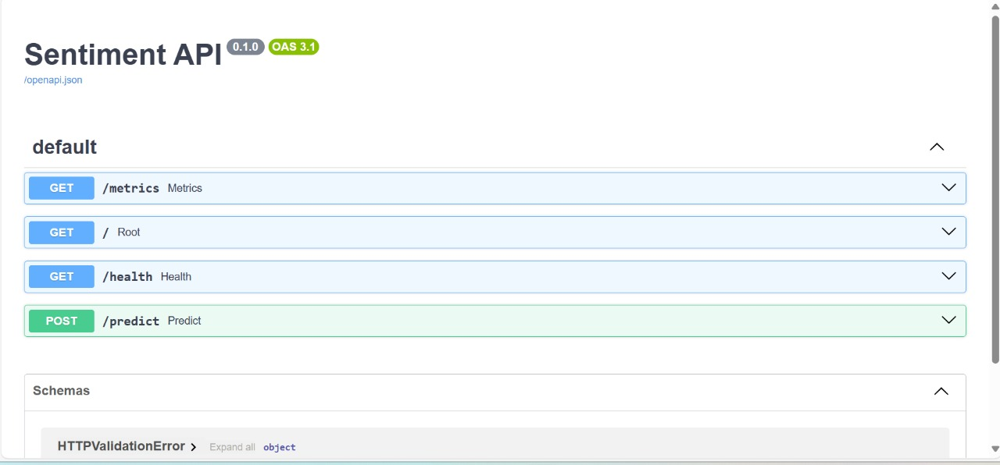
---

### 🧠 4. Run Monitoring Stack

```bash
docker compose up --build
```

| Service         | URL                                                      | Default Login |
| --------------- | -------------------------------------------------------- | ------------- |
| API             | [http://localhost:8000/docs](http://localhost:8000/docs) | —             |
| Prometheus      | [http://localhost:9090](http://localhost:9090)           | —             |
| Grafana         | [http://localhost:3000](http://localhost:3000)           | admin / admin |
| Evidently Drift | [http://localhost:7000](http://localhost:7000)           | —             |

---

## 📈 **Evaluation**

We measure:

* ✅ **Recall@K** → true item in top-K?
* ✅ **nDCG@K** → discounted gain for correct ranking
* ✅ **Catalog Coverage** → % of unique items recommended

Run manually:

```bash
python -m src.evaluate --data-dir data/processed --k 10
```

---

## 🧾 **MLflow Model Registry**

Tracked & versioned experiments with MLflow.

| Model                 | Version | Stage      | URI                                                              |
| --------------------- | ------- | ---------- | ---------------------------------------------------------------- |
| `product-recommender` | v1.0    | Production | [http://localhost:5000/#/models](http://localhost:5000/#/models) |

To start MLflow tracking server:

```bash
mlflow server --host 0.0.0.0 --port 5000
```

---

## 📊 **Monitoring with Prometheus + Grafana**

* Prometheus scrapes `/metrics` from FastAPI.
* Grafana visualizes:

  * API latency
  * Requests per second
  * Prediction counts

📸 **Dashboard Snapshots:**
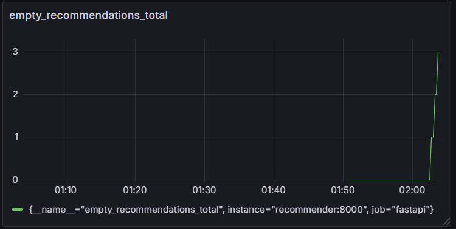
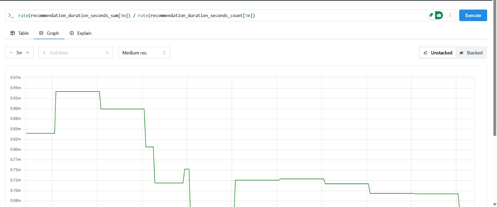

---

## 🧮 **Evidently (Data Drift Reports)**

Generate drift report:

```bash
make drift
```

Serve the dashboard:

```bash
make serve-drift
```

👉 [http://localhost:7000](http://localhost:7000)

📸 Example:
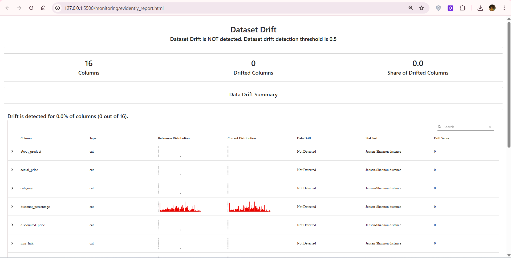

---

## ☁️ **Cloud Deployment**

### 🌩️ AWS Integration

| Component     | AWS Service Used          | Purpose                  |
| ------------- | ------------------------- | ------------------------ |
| API Hosting   | **EC2**                   | Host FastAPI container   |
| Model Storage | **S3**                    | MLflow backend artifacts |
| Monitoring    | **CloudWatch (optional)** | Alerting / Logs          |

### 🖼️ AWS Components

<p align="center">
  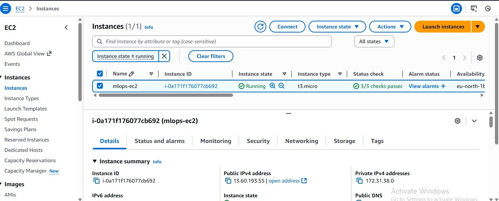
  &nbsp;&nbsp;&nbsp;
  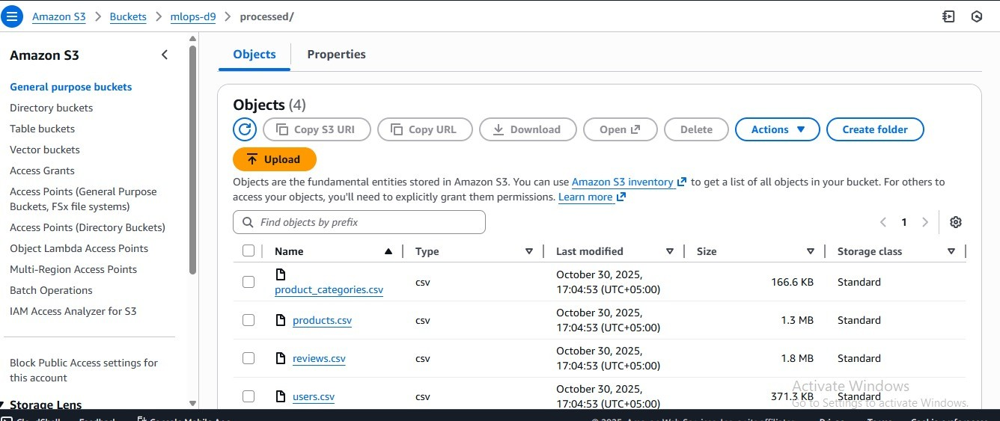
</p>

See 👉 [images](images) for additional setup and configuration screenshots !


🔧 **How to Reproduce Cloud Setup:**

1. Launch EC2 instance (Ubuntu 22.04, t2.medium)
2. Install Docker + Docker Compose
3. Clone repo and run `docker compose up -d`
4. Access the live stack:

| Service    | Public URL                                                     |
| ---------- | -------------------------------------------------------------- |
| API Docs   | [http://13.60.193.55:8000/docs](http://13.60.193.55:8000/docs) |
| Grafana    | [http://13.60.193.55:3000](http://13.60.193.55:3000)           |
| Prometheus | [http://13.60.193.55:9090](http://13.60.193.55:9090)           |

---

## ⚙️ **Makefile Targets**

| Command            | Description                       |
| ------------------ | --------------------------------- |
| `make dev`         | Run FastAPI with hot-reload       |
| `make train`       | Train and register model          |
| `make drift`       | Generate Evidently drift report   |
| `make serve-drift` | Serve drift dashboard (port 7000) |
| `make stack-up`    | Bring up Docker monitoring stack  |
| `make stack-down`  | Stop Docker containers            |

---


Includes:

* Member names & ERP IDs
* Task allocation (data, model, infra, monitoring)
* Branch naming conventions (`feat/`, `fix/`, `infra/`)

---

## 🧹 **Pre-Commit Hooks**

✅ Configured hooks:

* `trailing-whitespace`
* `end-of-file-fixer`
* `detect-secrets`
* `black` + `ruff` formatters

Run manually:

```bash
pre-commit run --all-files
```

---

## 🧪 **GitHub CI/CD (Milestone Requirement)**

| Stage            | Description                            |
| ---------------- | -------------------------------------- |
| 🧼 Lint          | Check style via Ruff + Black           |
| 🧠 Test          | Run pytest (≥80% coverage)             |
| 🏗️ Build        | Docker image tagged with `$GITHUB_SHA` |
| 🧪 Canary Deploy | Push image to canary env               |
| 🩺 Acceptance    | Test 5+ golden requests on canary      |

✅ Defined in `.github/workflows/ci.yml`

---

## 🧰 **FAQ**

**Q:** Why UTF-16 in requirements.txt?
**A:** Some systems needed BOM-encoded format for compatibility; open with UTF-16 in editors if installation fails.

**Q:** How do I fix Docker permission issues on Windows?
**A:** Run PowerShell as Admin → `wsl --update` → restart Docker Desktop.

**Q:** Grafana dashboard not showing data?
**A:** Ensure Prometheus target (`/metrics`) is healthy at [http://localhost:9090/targets](http://localhost:9090/targets).

---

## 🔮 **Future Vision (LLMOps Stage 2)**

> “Beyond recommendations — we aim for intelligent conversations about products.” 🧠💬

In Milestone-2, we’ll enhance our system into a **multimodal LLMOps pipeline**:

* 🤖 Generate **personalized product reviews** based on user history.
* 🗣️ Use **LLMs (like GPT-4 or Falcon)** for summarizing customer sentiment.
* 🔍 Provide **context-aware recommendations** combining embeddings from text and structured data.
* 📦 Deploy via **LangChain + FastAPI + MLflow Serving** with real-time drift alerts.

**Use Cases:**

* 🛍️ Smart shopping assistants that summarize reviews.
* 💬 Automated brand insight generation.
* 📈 Continuous model retraining triggered by drift reports.

---

## 🪪 **License & Compliance**

* 📜 **License:** MIT License — see `LICENSE`
* 🤝 **Code of Conduct:** Contributor Covenant — `CODE_OF_CONDUCT.md`
* 🧩 **Dependency Scan:** `pip-audit` integrated (fails build on critical CVEs)

---

## 🏁 **Known Issues / TODOs**

* [ ] Fix Dockerfile app entry path → `src.api:app`
* [ ] Validate all import paths in `train.py`
* [ ] Add additional unit tests for drift metrics
* [ ] Integrate GitHub container registry publishing

---

## ✨ **Screenshots**

| Component       | Preview                                      |
| --------------- | -------------------------------------------- |
| 🐳 Docker Setup | 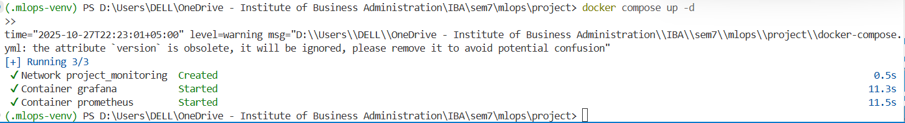     |
| 📈 Grafana      | 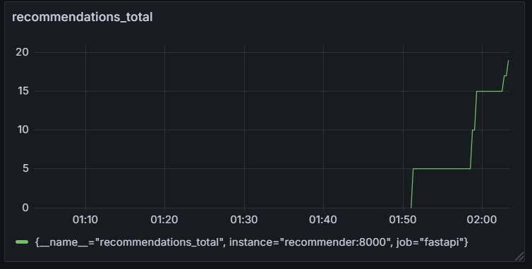 |
| 🧮 MLflow       | 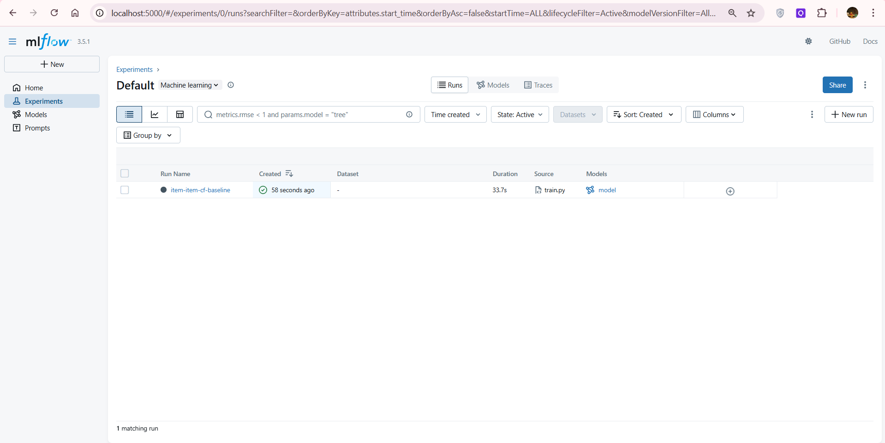               |
| 🔍 Evidently    | 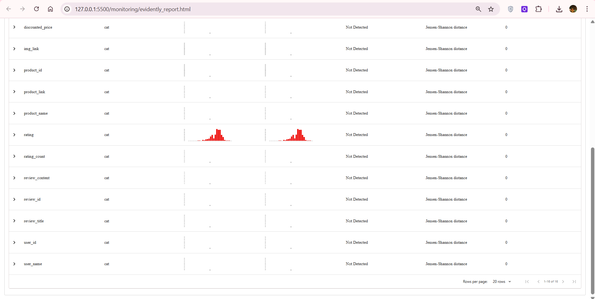      |

---

## 🌟 **Team**

| Name             | ERP ID | Role                                    |
| ---------------- | ------ | --------------------------------------- |
| **Zuha Aqib**    | 26106  | Team Lead — Data Pipeline & Model Training + CI/CD |
| **Maham Junaid** | 26909  | Cloud Integration & Monitoring setup    |
| **Maryam Ihsan** | 27152  | Evaluation & API Documentation    |
| **Muhammad Haaris** | 27083  | Data Pipeline & Model Training + CI/CD  |

---


## 🧩 Task Breakdown and Contributions

| Member           | Primary Responsibilities                       | Details of Work Done                                                                                                                                                                                                                                                                                                                                                                                                                                                                                |
| ---------------- | ---------------------------------------------- | --------------------------------------------------------------------------------------------------------------------------------------------------------------------------------------------------------------------------------------------------------------------------------------------------------------------------------------------------------------------------------------------------------------------------------------------------------------------------------------------------- |
| **Zuha Aqib**    | Data Pipeline, Model Training, and CI/CD | <ul><li>Led data cleaning and preprocessing of Amazon reviews dataset</li><li>Implemented core data pipeline architecture</li><li>Co-developed **Item–Item Collaborative Filtering** algorithm</li><li>Implemented GitHub Actions workflow for CI/CD pipeline</li><li>Set up automated testing and linting checks</li><li>Created data validation and model testing workflows</li><li>Managed model versioning and artifact tracking</li><li>Implemented automated deployment pipelines</li></ul> |
| **Muhammad Haaris** | Data Pipeline, Model Training, and CI/CD | <ul><li>Co-developed data preprocessing and cleaning workflows</li><li>Implemented train-test split methodology</li><li>Enhanced **Item–Item Collaborative Filtering** implementation</li><li>Set up Docker containerization for model training</li><li>Configured CI/CD pipelines for model deployment</li><li>Implemented automated model retraining workflows</li><li>Created data validation checks</li><li>Set up monitoring for model training pipelines</li></ul> |
| **Maham Junaid** | Cloud Integration & API Documentation | <ul><li>Implemented AWS EC2 instance setup for model deployment</li><li>Configured S3 buckets for data and model storage</li><li>Set up CloudWatch monitoring for model performance</li><li>Created comprehensive FastAPI documentation</li><li>Developed API schema and example cURL commands</li><li>Implemented automated API testing</li><li>Created cloud infrastructure documentation</li><li>Set up cloud-based monitoring dashboards</li></ul> |
| **Maryam Ihsan** | Cloud Integration & API Documentation | <ul><li>Configured AWS Lambda functions for serverless operations</li><li>Implemented automated cloud deployment scripts</li><li>Created cloud service integration documentation</li><li>Enhanced FastAPI documentation with detailed examples</li><li>Developed comprehensive API testing suite</li><li>Created cloud deployment guides in README.md</li><li>Documented cloud service interactions</li><li>Implemented cloud resource monitoring</li></ul> |

---

## 🌿 Branch-Naming Convention

| Branch Name                        | Prefix Category           | Purpose / Description                                                                                              |
| ---------------------------------- | ------------------------- | ------------------------------------------------------------------------------------------------------------------ |
| **`fix/structure`**                | `fix/`                    | Minor structural fixes and directory cleanup after initial setup (refined imports, paths, and relative structure). |
| **`infra/app-setup`**              | `infra/`                  | Configured application infrastructure — FastAPI service wiring, environment variables, and app-level organization. |
| **`infra/bootstrap-setup`**        | `infra/`                  | Initial repository bootstrap: virtual environment, Makefile, requirements, and local project scaffolding.          |
| **`infra/cloud-integration`**      | `infra/`                  | Cloud integration setup — connecting Dockerized services with cloud endpoints (planned deployment stage).          |
| **`ml-workflow-monitoring-setup`** | `ml-workflow/` *(custom)* | Integrated ML workflow monitoring — Prometheus, Grafana dashboards, and MLflow logging integration.                |
| **`main`**                         | —                         | Stable release branch for milestone submissions and final presentation.                                            |


## 🧑‍💻 **Contribution Guide**

See 👉 [CONTRIBUTION.md](CONTRIBUTION.md)
updated information can be found in CONTRIBUTION.md

## 🌟 **Bonus Features**

| Bonus Feature                                | Description                                                                                                         | Status        |
| -------------------------------------------- | ------------------------------------------------------------------------------------------------------------------- | ------------- |
| 🐳 *Docker Compose Multi-Service Setup*    | Separate containers/services for *App, **DB, **Prometheus, and **Grafana*. Supports dev/test/prod profiles. | ✅ Implemented |
| ⚡ *GPU-enabled Image & Self-Hosted Runner* | CI/CD pipeline uses GPU-enabled Docker image for model training and integrates with self-hosted GitHub runner.      | ▓▓░░░ 40%     |
| 🏗️ *IaC Sample (Terraform / MinIO)*       | Example scripts to spin up local object storage (MinIO) and other resources via Terraform or other IaC tools.       | ▓░░░░ 20%     |
| 📊 *End-to-End Load Test Script (k6)*      | Load testing scripts with latency SLO assertions for the deployed services.                                         | ▓░░░░ 30%     |
| 🛡️ *Dependency Vulnerability Scan*        | pip-audit checks for critical CVEs and fails build if found.                                                      | ✅ Implemented |
| 📦 *Git LFS (Large File Support)*          | Optional: Not required for this project due to dataset size, but pipeline supports it.                              | ✅ Implemented/ Optional   |

all remaining will be fully implemented in stage 2 !!!

## 💡 **Tag & Submission**

✅ Push with tag:

```bash
git tag v1.0-milestone1
git push origin v1.0-milestone1
```


---

### 💬 *“From product reviews to product intelligence — the journey starts here.”* 🧠💬✨

Developed with ❤️ by Team **Product Review Analyzer**

---
# 🚀 **Milestone 2: LLMOps — Operationalizing Large Language Models**
<p align="left">
  
  
  
  
</p>

> **Phase:** Large Language Model Integration & RAG System
> **Status:** ✅ Completed & Deployed
> **Tag:** `v2.0-milestone2`

## 🎯 **Milestone 2 Overview**

Building on our reproducible MLOps foundation, **Milestone 2 extends the system into the world of LLMOps** — managing the complete lifecycle of Large Language Models. We've designed, implemented, and evaluated a production-ready **Prompt Engineering + RAG (Retrieval-Augmented Generation)** system that demonstrates best practices in:

- ✅ **Prompt Experimentation** — Zero-Shot, Few-Shot, Chain-of-Thought strategies
- ✅ **RAG Workflow** — Document ingestion, retrieval, and context-aware generation
- ✅ **Safety & Guardrails** — PII detection, prompt injection filtering, hallucination prevention
- ✅ **Monitoring & Evaluation** — Token usage, latency, guardrail violations, data drift
- ✅ **CI/CD Automation** — End-to-end testing, canary deployment, cloud integration

---

## 📌 Overview

This project evolved through **two major milestones**:

| Stage                    | Focus                                                                                                                 | Outcome                                                                                                                                                                                       |
| ------------------------ | --------------------------------------------------------------------------------------------------------------------- | --------------------------------------------------------------------------------------------------------------------------------------------------------------------------------------------- |
| **Milestone 1 (MLOps)**  | Build a reproducible ML recommender system with monitoring, CI/CD, and deployment.                                    | Working **Item-Item Collaborative Filtering** recommender served through **FastAPI**, tracked with **MLflow**, monitored with **Prometheus/Grafana**, deployed to cloud.                      |
| **Milestone 2 (LLMOps)** | Extend the ML workflow into a hybrid **ML + RAG + LLM** pipeline with prompt experimentation, safety, and evaluation. | Full working **Retrieval-Augmented Generation (RAG)** system, multiple prompting strategies, evaluation dataset, automated experimentation engine, guardrails, dashboards, and documentation. |

This system now acts as an **AI Shopping Assistant** that:

* Retrieves relevant products using **FAISS+embeddings**
* Recommends personalized items using an **ML recommender**
* Generates summarized, contextual answers using an **LLM advisor**
* Ensures safety with **input/output moderation**
* Evaluates LLM performance across **multiple prompting strategies**
* Is fully monitored, reproducible, and deployable.

---

## 🧠 System Architecture Summary

```
    ┌───────────────────────────────┐
    │ User Query                    │
    └───────────────┬───────────────┘
                    │
          Guardrails: Input Filter
                    │
         ┌──────────▼─────────┐
         │     pipeline.py     │
         └──────────┬─────────┘
                    │
     ┌──────────────┼─────────────────┐
     │              │                 │
     ▼              ▼                 ▼
ML Model       RAG Retrieval       Prompt Strategy
(Item-Item CF) (FAISS + Embeddings) (zero-shot / few-shot / CoT / meta)
     │              │                 │
     └──────────────┴─────────────────┘
                    │
           Advisor LLM (Gemini/Qwen)
                    │
         Guardrails: Output Moderation
                    │
                    ▼
              Final Response
```

---

## 📦 Core Components

### 🔹 Machine Learning Recommender

* Implemented using **Item-Item Collaborative Filtering**
* Uses user–product interaction matrix
* Computes similarity using cosine similarity
* Outputs top-k personalized recommendations

Files:

* `item_item.py`
* `service.py`
* `eval_dataset.py`
* `metrics.py`

Evaluation metrics include:

* Recall@K
* NDCG@K
* Catalog Coverage

ML experiments are tracked in **MLflow**.

---

### 🔹 Retrieval-Augmented Generation (RAG)

The RAG system improves factual grounding.

**Indexing (offline):**

* Processes product dataset into text blocks
* Embeds using `BAAI/bge-small-en-v1.5`
* Stores embeddings + metadata in FAISS

File: `ingest.py`

**Inference (online):**

* Retrieve top relevant documents using FAISS
* Extract product metadata
* Package into structured prompt context

Files: `rag.py`, `rag_service.py`

---

### 🔹 LLM Advisor + Prompting System

LLM layer generates final natural-language responses.

Supported prompting modes:

| Strategy             | Example                                       | Purpose                        |
| -------------------- | --------------------------------------------- | ------------------------------ |
| **Zero-shot**        | “Recommend me a budget phone”                 | Simple baseline                |
| **Few-shot**         | Use training pairs from sample_responses.json | Improve structure & reasoning  |
| **Chain-of-Thought** | “Think step-by-step…”                         | Improve reasoning transparency |
| **Meta Prompting**   | A structured system persona with rules        | Most controlled, consistent    |

The final message is strictly:

* Short
* factual
* based on retrieved evidence
* safe and grounded

File: `advisor.py`

---

### 🔹 Guardrails & Safety

The system prevents:

* Prompt injection
* Toxic language
* Personal data leakage
* Unsafe claims

File: `policy.py`

These are enforced **before LLM call (input)** and **after output (post-processing).**

---

### 🔹 Experimentation Engine (LLMOps Core)

Automates prompt experiments and logs results.

* Reads experiment plan from `experiments_config.csv`
* Injects chosen prompt strategy
* Calls HF Space Qwen model or Gemini
* Logs:

  * response text
  * latency
  * prompt variant
  * correctness score
  * metadata

Outputs stored in:

* `experiment_results.csv`
* eval JSON files used later by humans

File: `run_experiments.py`

---

## 📑 Evaluation Dataset

File: `eval_dataset.py` ()

Contains **leave-one-out split logic** for fair evaluation of ML and LLM responses.

Dataset includes:

* Real product queries
* Expected answers
* Metadata for scoring

Evaluation is done using:

* Automated embedding similarity scoring
* Human rating template (helpfulness, factuality, safety)

---

## 🛠️ Setup & Installation

### 1️⃣ Clone the project

```bash
git clone <repo_url>
cd <project_name>
```

### 2️⃣ Create environment

```bash
python -m venv .venv
source .venv/bin/activate
```

### 3️⃣ Install dependencies

> For local development:

```bash
pip install -r requirements_all.txt
```

> For cloud deployment:

```bash
pip install -r requirements.txt
```

### 4️⃣ (Optional) Clean dependencies

```bash
pip freeze > requirements_all.txt
pip freeze > requirements.txt
pipreqs . --force --encoding=utf-8 --ignore .venv,.git
```

---

## ▶️ Running the System

Terminal 1 (backend API):

```bash
uvicorn src.app:app --reload
```

Terminal 2 (UI):

```bash
streamlit run src/streamlit_app.py
```

---

## 🔄 Running Prompt Experiments

```bash
python src/run_experiments.py
```

Outputs written to:

* `/experiments/experiment_results.csv`
* `/experiments/eval.jsonl`

---

## 🌥️ Cloud Deployment Summary

* AWS EC2 → Deployed FastAPI + Streamlit
* S3 → Storage for embeddings and MLflow artifacts
* CloudWatch → Logs and alerting
* Docker + CI/CD → Automated deploy on push

---

---

## 🔥 **The Star of the Show: Fine-Tuned Model & Hugging Face**

We didn't just rely on generic models. We trained our own! 🚀

We performed **Supervised Fine-Tuning (SFT)** on the **Qwen2.5-7B** architecture using a custom dataset of query-response pairs derived from our Amazon reviews data. This ensures the model speaks the language of "e-commerce" natively!

### 🤖 **1. The Model (Qwen2.5-7B-ProductReviewAnalyzer-SFT)**
You can download, use, or evaluate our fine-tuned weights directly from Hugging Face.

> 👉 **[Access the SFT Model on Hugging Face](https://huggingface.co/MuhammadHaaris/Qwen2.5-7B-ProductReviewAnalyzer-SFT-FP16)**

### 🌌 **2. Live Demo (Hugging Face Spaces)**
Want to try it without coding? We hosted the fine-tuned version on a **Gradio** interface.

> 👉 **[Try the Live Demo Here](https://huggingface.co/spaces/MuhammadHaaris/mlops)**

---


## 📡 Monitoring

| Component                         | Monitoring Tool      |
| --------------------------------- | -------------------- |
| API requests, latency, throughput | Prometheus + Grafana |
| ML model drift                    | Evidently            |
| Guardrail events                  | Logging + dashboard  |
| Experiment tracking               | MLflow               |

---
---

## 🌐 **Service Endpoints (Dev/Stage)**

Here are the main URLs for accessing the deployed services in your local or staging environment:

| Service         | URL                                         | Description                       |
|-----------------|---------------------------------------------|-----------------------------------|
| 🛠️ Backend API  | [http://localhost:8001/](http://localhost:8001/)         | FastAPI backend (custom port)     |
| 📊 Grafana      | [http://localhost:3001/](http://localhost:3001/)         | Grafana dashboards (custom port)  |
| 📈 Prometheus   | [http://localhost:9091/targets](http://localhost:9091/targets) | Prometheus targets/metrics        |
| 🖥️ Streamlit UI | [http://localhost:8501/](http://localhost:8501/)         | Streamlit frontend                |

> ⚡ **Note:** These endpoints may differ from default ports. Use these for development, testing, and monitoring your stack.
## 👥 Team & Contributions

| Name                | Role                   | Contribution Summary                                                        |
| ------------------- | ---------------------- | --------------------------------------------------------------------------- |
| **Zuha Aqib**       | Pipeline Lead          | Designed pipeline, integrated ML + RAG + LLM, final merging, UI integration |
| **Muhammad Haaris** | RAG & Fine-Tuning Lead | Built RAG system, embeddings indexing, SFT dataset, experiment logic        |
| **Maryam**          | Cloud Lead             | Cloud deployment, AWS setup, remote access, environment configuration       |
| **Maham**           | Cloud Lead             | Containerization, infra debug, deployment, documentation                    |

---

## 🏁 Submission + Tags

Milestone 2 final tag:

```bash
git tag v2.0-milestone2
git push origin v2.0-milestone2
```

---

## 📌 Final Notes

* The project is fully reproducible end-to-end.
* It demonstrates full lifecycle management across **MLOps → LLMOps**.
* Architecture supports future extensibility such as:

  * multimodal inputs
  * A/B testing dashboards
  * model retraining triggers
  * LangChain/LlamaIndex integration

---

### 🧩 One-Sentence Summary

> *This project transforms raw product data into a safe, intelligent AI shopping assistant powered by ML recommendations, retrieval-augmented reasoning, and structured LLM experimentation.*
